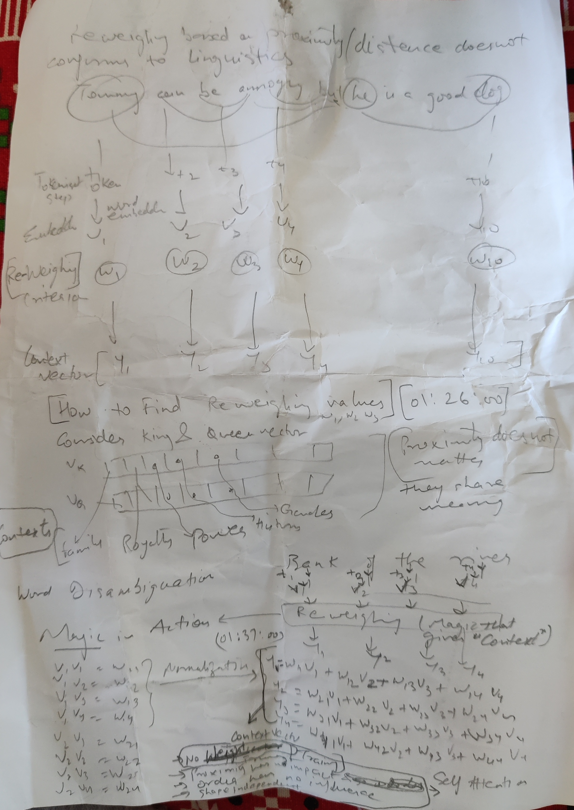

# Attention
- [Paper](https://arxiv.org/pdf/1706.03762.pdf)
- [Neural Machine Translation Model-Mechanics of Seq2seq Models With Attention](https://jalammar.github.io/visualizing-neural-machine-translation-mechanics-of-seq2seq-models-with-attention/)
- https://jalammar.github.io/illustrated-transformer/
- https://proceedings.neurips.cc/paper/2017/file/3f5ee243547dee91fbd053c1c4a845aa-Paper.pdf
- https://github.com/tensorflow/tensor2tensor
- https://github.com/tensorflow/tensor2tensor/blob/master/tensor2tensor/notebooks/hello_t2t.ipynb

 ## Attention
 Idea is to build a "context" vector 
 Find context at any point of time of a sequence
 Diagram  from notes
 
 Implemented this block
 Building blocks of attention
 
 Reweighing  (remove Noise)
 Normalization
 Dot Product
 
 Attention Block connects 2 Blocks - Encoder , Decoder
 
 King vector  , context vector will be more meaningful
 
 
 
 Context Building 
 
 Normalize
 
 Transform
 
 Dot product
 
 Reweighing 
 
 Filters data text is far away
 Amplify data which is closer
 Smoother data
 Resulting vector can be fed to algorithm now
 
 Reweighing based on proximity/distance does not confirm to linguistics.
 Tommy can be annoying but he is a good dog.
 
## 1.attention_intution

## 2.attention_block

## 3.attention_database_analogy

## 4.Self_attention_introduced_matrices_as_learnable_parameters

## 5.attention_in_transformers

## 6.POS_Tag_Multiple_attention_layers

## 7.Multi_headed_attention

## Page1

## Page2

