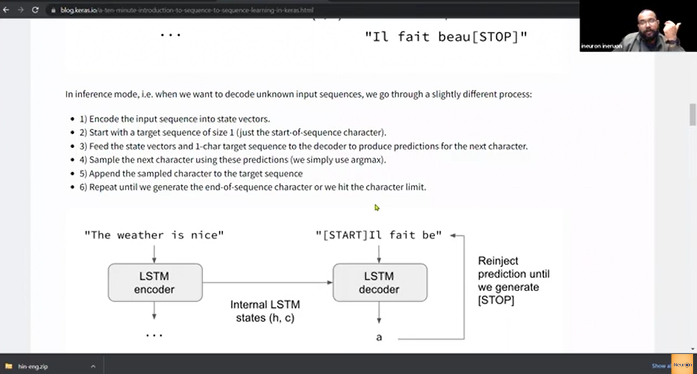

# Encoder Decoder
- [Why encoder decoder](#why-encoder-decoder)
  - [Handling variable length input and output sequences](#handling-variable-length-input-and-output-sequences)
  - [Improving context representation](#improving-context-representation)
  - [Providing flexibility in sequence generation](#providing-flexibility-in-sequence-generation)
  - [Example](#example)
- [Types](#types)
  - [RNN based encoder decoder](#rnn-based-encoder-decoder)
  - [Transformer based encoder decoder](#transformer-based-encoder-decoder)
- [Building block of a encoder decoder](#building-block-of-a-encoder-decoder)
- [Illustration of encoder decoder architecture](#illustration-of-encoder-decoder-architecture)
  - [Code example in TensorFlow and Keras](#code-example-in-tensorflow-and-keras)
- [Seq to Seq](https://jalammar.github.io/visualizing-neural-machine-translation-mechanics-of-seq2seq-models-with-attention/)
- [Keras](https://blog.keras.io/a-ten-minute-introduction-to-sequence-to-sequence-learning-in-keras.html)
- [lstm-seq2seq](https://github.com/bond005/seq2seq)
- [Basic Encoder Decoder](https://colab.research.google.com/github/kmkarakaya/ML_tutorials/blob/master/seq2seq_Part_C_Basic_Encoder_Decoder.ipynb)
## Why encoder decoder


- Encoder-decoder architectures were introduced to address several limitations and enhance the capabilities of sequence-to-sequence models, even when using advanced techniques like bidirectional RNNs. 
- Let's break down the key reasons

### Handling variable length input and output sequences
- Bidirectional RNNs process sequences in both directions but are still designed to output sequences of the same length as the input. 
- Encoder-decoder architectures can handle variable-length input and output sequences, which is crucial for tasks like machine translation, where the source and target sentences may have different lengths.

### Improving context representation
- While bidirectional RNNs can capture information from both directions, they may still struggle with very long sequences. 
- An encoder-decoder architecture separates the task into two phases:
  - **Encoder**: Reads the entire input sequence and compresses it into a fixed-length **context vector**.
  - **Decoder**: Takes the context vector and generates the output sequence step-by-step. 
- This separation helps in **managing `long-term dependencies` more effectively**.

### Providing flexibility in sequence generation
- The encoder-decoder framework offers flexibility in generating sequences. 
- The decoder can attend to different parts of the input sequence at each step, especially when combined with attention mechanisms. 
- This allows the model to focus on relevant parts of the input, improving the quality of the generated output.

### Facilitating attention mechanisms
- Attention mechanisms enhance the encoder-decoder architecture by **allowing the `decoder` to access different parts of the `encoder's output` dynamically**. 
- This is particularly useful in tasks like translation, where certain words in the input sequence need more attention when generating the corresponding output.

### Example
- Consider translating a sentence from English to French:
- **Bidirectional RNN**: 
  - Processes the English sentence in both directions but may have limitations with very long sentences.
- **Encoder-Decoder**: 
  - The encoder processes the entire English sentence and creates a context vector. 
  - The decoder then generates the French sentence one word at a time, attending to different parts of the context vector as needed.

## Types
- Encoder-decoder architectures can utilize various types of neural networks internally, including RNNs (Recurrent Neural Networks), but they are not limited to them. Here's a breakdown:
### RNN based encoder decoder
- **Usage**
  - Traditional encoder-decoder models often use RNNs (such as LSTMs or GRUs) for both the encoder and decoder.
- **Function**
  - **Encoder**: Processes the input sequence and compresses it into a context vector.
  - **Decoder**: Generates the output sequence from the context vector.
- **Example**
  - Early neural machine translation models use RNNs to handle sequential data.

<details>
  <summary>Details</summary>
  
  - Earlier encoder-decoder architectures were predominantly based on Recurrent Neural Networks (RNNs), which include Long Short-Term Memory networks (LSTMs) and Gated Recurrent Units (GRUs).
  - Here's a brief overview:
  ### Recurrent Neural Networks (RNNs)
  - **Architecture**: Sequential processing, where each time step depends on the previous one.
  - **Challenges**: Struggle with long-term dependencies due to the vanishing gradient problem.
  
  ### Long Short-Term Memory (LSTM)
  - **Architecture**: An enhanced type of RNN designed to handle long-term dependencies.
  - **Components**: Memory cells, input gates, output gates, and forget gates.
  - **Advantages**: Mitigates the vanishing gradient problem, making it more effective for tasks that require memory over long sequences.
  
  ### Gated Recurrent Unit (GRU)
  - **Architecture**: A simplified version of LSTM, with fewer gates.
  - **Components**: Update gate and reset gate.
  - **Advantages**: Comparable performance to LSTMs but with a simpler structure and faster training.
  
  ### Example Use Case: Machine Translation
  - **Encoder**: Processes the input sequence (e.g., a sentence in English) and encodes it into a context vector.
  - **Decoder**: Takes the context vector and generates the output sequence (e.g., the translation in French).
  
  ### Illustration
  ```
  Input Sentence: "The cat is on the mat."
  
  Encoder (RNN/LSTM/GRU):
      "The" -> [context]
      "cat" -> [context]
      "is" -> [context]
      "on" -> [context]
      "the" -> [context]
      "mat" -> [context vector]
  
  Decoder (RNN/LSTM/GRU):
      [context vector] -> "Le" -> "chat" -> "est" -> "sur" -> "le" -> "tapis."
  ```  

  </details>

### Transformer based encoder decoder
- **Usage**
  - `More recent encoder-decoder models`, especially for NLP tasks, **use transformers instead of RNNs**.
- **Function**:
  - **Encoder**: Uses self-attention mechanisms to process the input sequence in parallel and capture context.
  - **Decoder**: Also uses self-attention to generate the output sequence, attending to relevant parts of the encoded input.
- **Example**: The Transformer model itself, and subsequent models like BERT and GPT, rely on this architecture.

### Summary
- **RNN-based Encoder-Decoder**: Utilizes RNNs to handle sequential dependencies, commonly found in earlier models.
- **Transformer-based Encoder-Decoder**: Utilizes self-attention mechanisms for parallel processing and better handling of long-range dependencies, commonly found in modern models.

## Building block of a encoder decoder
- The building blocks of an encoder-decoder architecture can vary depending on the specific implementation.
- However, the most common and influential components include
### Encoder
- **Purpose**
  - To process and encode the input sequence into a fixed-length context vector or a sequence of context vectors.
- **Components**
  - **Embedding Layer**: Converts input tokens into dense vectors of fixed size.
  - **Recurrent Layers (RNN/LSTM/GRU)**: For RNN-based models, these layers capture temporal dependencies.
  - **Self-Attention Layers**: For transformer-based models, these layers allow the model to weigh the importance of each input token relative to others.
  - **Positional Encoding**: For transformers, this adds information about the position of tokens in the sequence.

### Decoder
- **Purpose**
  - To generate the output sequence using the encoded information.
- **Components**:
  - **Embedding Layer**: Converts output tokens into dense vectors of fixed size.
  - **Recurrent Layers (RNN/LSTM/GRU)**: For RNN-based models, these layers generate the output sequence step-by-step.
  - **Self-Attention Layers**: For transformer-based models, these layers allow the decoder to focus on relevant parts of the input and previously generated output.
  - **Positional Encoding**: For transformers, this adds positional information to the output tokens.

### Attention Mechanism (Optional but Common)
- **Purpose**
  - To enhance the model's ability to focus on relevant parts of the input sequence during decoding.
- **Components**:
  - **Attention Scores**: Calculate the relevance of each input token to the current output token.
  - **Context Vector**: Combines the input tokens weighted by their attention scores, providing additional context to the decoder.

### Final Linear and Softmax Layers
- **Purpose**
  - To transform the decoder's output into a probability distribution over the possible output tokens.
- **Components**:
  - **Linear Layer**: Projects the decoder's output to the vocabulary size.
  - **Softmax Layer**: Converts the linear projections into probabilities.

### Visual Representation:
- These components work together to process the input sequence and generate the desired output sequence, making encoder-decoder architectures versatile for various sequence-to-sequence tasks like `translation, summarization`, and more.
```
+----------------+        +----------------+
|    Encoder     |        |    Decoder     |
|                |        |                |
| Input -> Embed |  ----> |  Embed -> Output|
|    + LSTM/GRU  |        |  + LSTM/GRU    |
|    + Attention |        |  + Attention   |
|    + Positional|        |  + Positional  |
|     Encoding   |        |     Encoding   |
+----------------+        +----------------+
```

## Illustration of encoder decoder architecture
1. **Encoder**: 
   - Input: "The cat sits on the mat"
   - Output: Context vector (compressed representation of the input)

2. **Decoder**:
   - Input: Context vector
   - Output: "Le chat est assis sur le tapis" (translated sentence)

### Code example in TensorFlow and Keras
#### Encoder
```python
from tensorflow.keras.layers import Input, LSTM, Embedding
from tensorflow.keras.models import Model

encoder_inputs = Input(shape=(None,))
encoder_embedding = Embedding(input_dim=vocab_size, output_dim=128)(encoder_inputs)
encoder_lstm = LSTM(256, return_state=True)
encoder_outputs, state_h, state_c = encoder_lstm(encoder_embedding)
encoder_states = [state_h, state_c]
```

#### Decoder
```python
from tensorflow.keras.layers import Dense

decoder_inputs = Input(shape=(None,))
decoder_embedding = Embedding(input_dim=vocab_size, output_dim=128)(decoder_inputs)
decoder_lstm = LSTM(256, return_sequences=True, return_state=True)
decoder_outputs, _, _ = decoder_lstm(decoder_embedding, initial_state=encoder_states)
decoder_dense = Dense(vocab_size, activation='softmax')
decoder_outputs = decoder_dense(decoder_outputs)
```

#### Full Model
```python
from tensorflow.keras.models import Model

model = Model([encoder_inputs, decoder_inputs], decoder_outputs)
model.compile(optimizer='adam', loss='sparse_categorical_crossentropy')
model.fit([encoder_input_data, decoder_input_data], decoder_target_data, epochs=10)
```

### Conclusion
- The encoder-decoder architecture with attention mechanisms represents a significant advancement over bidirectional RNNs by addressing their limitations and enhancing sequence-to-sequence learning capabilities. 
- This architecture allows for better handling of variable-length sequences, improved long-term dependency management, and greater flexibility in sequence generation.
