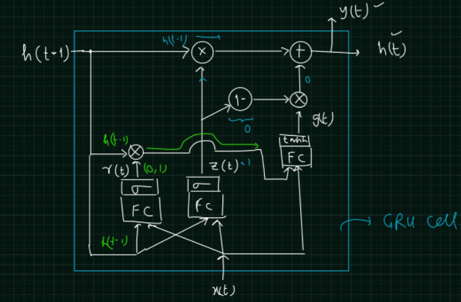

# GRU
- Gated Reccurent Unit
- 2014 by KyungHyun Cho
- GRU is similar to an LSTM, but only has two gates - a **reset** gate and an **update** gate - and notably **lacks an output** gate. 
- Fewer parameters means GRUs are generally easier/faster to train than their LSTM counterparts.

## GRU cell

