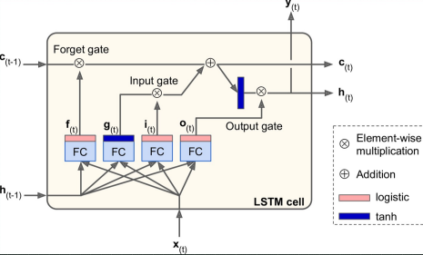

# LSTM in action

## Consider different states coming in and going out from a LSTM cell

## Long Term memory
### Forget gate
- **Previous Short** term state and **Current Input feature** will go through an **ANN**
- Result of ANN will go through **Sigmoid** function 
-  will now go through **MULTIPLICATION** operation, termed as **FORGET** gate
  - As Sigmoid would result in a value between `0 and 1`, so  will control what percentage of **Previous** long term state to pass to the **Current** long term state

### Input Gate
- **Previous Short** term state and **Current Input feature** will go through an **ANN**
- Result of ANN will go through **tanh** function 
  - Output of **tanh** lies between `-1 and +1`
- At the same time, we will also have 
  -  is based on **Sigmoid** function
- Now, at the **Input Gate**,  can be **+ve or -ve**
  -  will be **Multiplied** with 
  - Output at Input gate would be either a **+ve** or a **-ve** number
- This number will further **add** or **subtract** information from **Long** term memory
- Finally we have built our **Long term memory**

## Short term memory
### Output gate
- **Previous Short** term state and **Current Input feature** will go through an **ANN**
- Result of ANN will go through **Sigmoid** function 
- At the same time, **Long** term memory is passed through **tanh**
  - As Output of **tanh** lies between `-1 and +1`, this would give a **+ve** or a **-ve** number
-  and above generated **+ve** or  **-ve** number, will now go through **MULTIPLICATION** operation
- This will produce
  - **Short term memory**  and 
  - Output 
