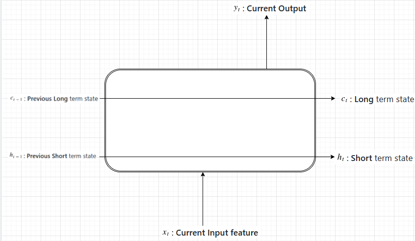

# LSTM in action

## Consider different states coming in and going out from a LSTM cell

## Long Term memory
### Forget gate
- **Previous Short** term state and **Current Input feature** will go through an **ANN**
- Result of ANN will go through **Sigmoid** function: 
-  will now go through **MULTIPLICATION** operation, termed as **FORGET** gate
  - As Sigmoid would result in a value between 0 and 1, so  will control what percentage of **Previous** long term state to pass to the **Current** long term state

