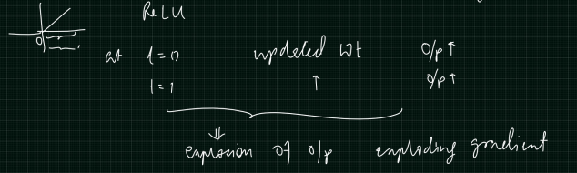
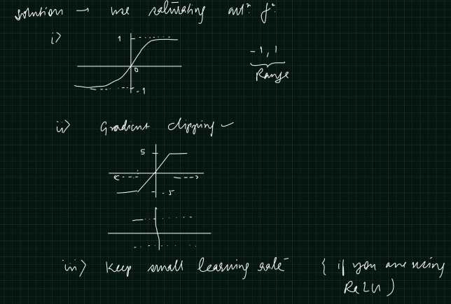
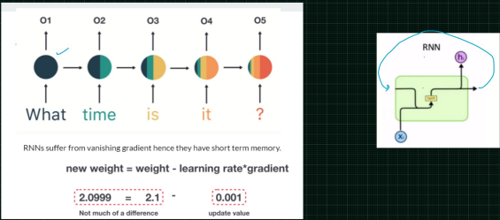
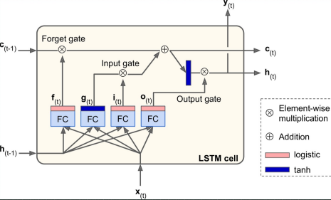

# Long Short Term Memory
- [Why LSTM?](#why-lstm)
- [LSTM](#lstm)
  - [Blog](https://colah.github.io/posts/2015-08-Understanding-LSTMs/)
  - [Keras Implementation](#keras-implementation)
  - [Components](#components)
    - [States](#states)
    - [Output of FC layers](#output-of-fc-layers)
    - [Gates](#gates)
  - [LSTM in action](LSTMInAction.md)
- [Bais initialisation](#bais-initialisation)

## Why LSTM
### Problems in training simple RNNs
#### Problem 1: Unstable Gradients
- When we use **Unsaturated** activation function **RELU**
  - Update weight at t=0, if we are in +ve region, we would **Increase** the weight
    - This will result in increase in **Output**
  - Update weight at t=1, if we are in +ve region, we would **Increase** the weight
    - This will result in **FURTHER** increase in **Output**
  - This would eventually result in **EXPLODING GRADIENT**
    

#### Solution
- Use **Saturated** activation function **tanh**
- Perform **Gradient clipping**
  - Specify in which range we want tanh function to vary (**Fix the region**)
  - If we are in certain range on tanh function, we will get max value (**-5 to +5**)
  - **Gradient clipping** to prevent **Vanishing Gradient** problem
- Keep small **Learning rate** when using RELU, 
  - This will not allow large weight update hence preventing exploding gradient problem
 

#### Problem 2: Low memory retention


#### Solution
- LSTM, Long Short Term Memory and
- GRU, Gated Recurrent Unit

## LSTM
- Paper: In 1997 by Sepp Hochreiter
- LSTM architecture helps to remember the important things for **Long** term duration


### Keras Implementation
- Option 1: Optimized for GPU
```python
tf.keras.layers.LSTM(20,)
```
- Option 2: Offers more customization options but not optimised for GPUs
```python
tf.keras.RNN(tf.keras.layers.LSTMCells(20))
```
- Option 3: Time Distributed
```python
tf.keras.TimeDistributed(tf.keras.layers.Dense(20))
```
### Components
#### States
- $c_{t}$ : **Long** term state
- $h_{t}$ : **Short** term state
- $c_{t-1}$ : **Previous Long** term state
- $h_{t-1}$ : **Previous Short** term state

#### Output of FC layers
- $f_{t}$ : has **Sigmoid** activation 
- $g_{t}$ : has **tanh** activation
- $i_{t}$ : has **Sigmoid** activation
- $o_{t}$ : has **Sigmoid** activation
- All FC layers will take 2 inputs
  - $x_{t}$ : **Current Input feature** 
  - $h_{t-1}$ : **Previous Short** term state
- $y_{t}$ : **Current Output** 
#### Gates
- Gates would generate the memory elements
- **Forget** Gate
- **Input** Gate
  - **Input** Gate adds to **Forget** Gate to produce **Long** term state
- **Output** Gate

##### Forget Gate
- Takes 2 Inputs
  - $c_{t-1} : **Previous Long** term state
  - $f_{t}$ : with **Sigmoid** activation
- Produces an Output that results in $c_{t}$ : **Long** term state
##### Input Gate
- Takes 2 Inputs
  - $g_{t}$ : with **tanh** activation
  - $i_{t}$ : with **Sigmoid** activation
- The output will **ADD** to Forget gate Output that results in $c_{t}$ : **Long** term state
##### Output Gate
- $c_{t}$ : **Long** term state, passed through **tanh**
- $o_{t}$ : with **Sigmoid** activation
- Produces an Output that results in $h_{t}$ : **Short** term state

## Bais initialisation
- Weights are initialised as 1 (instead of 0 in ANNs and other ML models)
- Initialising BIAS with 0 for RNN will result in totally discarding values
- for RNN Initialise `BIAS` with 1, because in LSTM we think about memory, so we would want to remeber initial values as well
