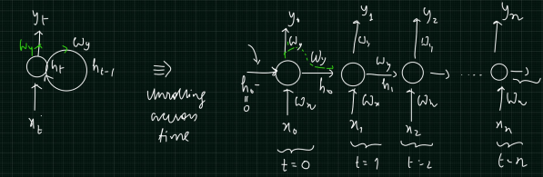
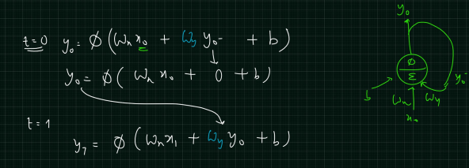
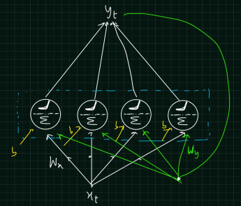
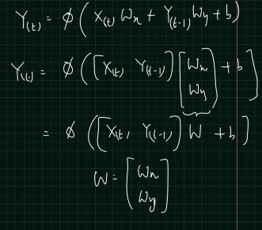
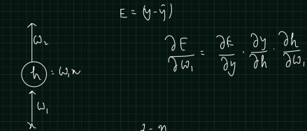

# RNN
- [Sequential data](#sequential-data)
  - [Feed Forward](#feed-forward)
  - [lecture](https://www.youtube.com/watch?v=n1_IFpFgc-k&t=3627s)
- [Why RNN?](#why-rnn)
- [RNN with a single neuron](#rnn-with-a-single-neuron)
- [RNN with a multiple neurons](#rnn-with-a-multiple-neurons)
- [BPTT](#bptt)
- [Types of RNN Configuration](#types-of-rnn-configuration)
  - [Seq to Seq](#seq-to-seq)
  - [Seq to Vector](#seq-to-vector)
  - [Vector to Sequence](#vector-to-sequence)
  - [Encoder-Decoder](#encoder-decoder)
- [Error calculations](#error-calculations)
- [How does RNN works](#how-does-rnn-works)

## Sequential data
- In Sequential data, value to be predicted at present state has dependency on previous state or values
- Examples: Time series (Stock price), Text data (Language Translation), Speech (Speech Recognition)
- We must remeber the previous values when dealing with the sequential data

### Feed Forward

## Why RNN
### Drawbacks of CNN and ANN
- There is no memory element
- The present data is not dependent on previous data
- Hence, CNN and ANN are not good for Sequential data
  
## RNN with a single neuron
- Below picture depicts how a RNN with a single Neuron will be expanded over time
- **Unrolling across time**- Bring information from `previous state` or previous timestamp (previous word or ngram)

### Equation

## RNN with a multiple neurons
- We always have multiple neurons in a single unit of RNN
- This unit repeats over time
- Orange color indicates bptt

### Equation

## BPTT 
- Back Propogation Through Time
- How will our Network **learn weights**

## Types of RNN Configuration
### Seq to Seq
- Timeseries use cases

### Seq to Vector
- Sentiment analysis (-ve or -ve)

### Vector to Sequence
- Image Captioning
  - Convert image into a matrix and provide **Vector** as an input to RNN
  - Output will be a **sentence** explaining what is happening in the image

### Encoder-Decoder
- Language translation

## Error calculations

### Partial derivative

### Weight Matrix

## How does RNN works

