# RNN
- [Depiction](#depiction)
- [Feed Forward](#feed-forward)
- [Previous State Input Neuron](#previous-state-input-neuron)
- [Previous State Input ANN](#previous-state-input-ann)
- [Types of RNN Configuration](#types-of-rnn-configuration)
  - [Seq to Seq](#seq-to-seq)
  - [Seq to Vector](#seq-to-vector)
  - [Vector to Seq](#vector-to-seq)
  - [Encoder-Decoder](#encoder-decoder)
- [RNN Equation and Weight Matrix](#rnn-equation-and-weight-matrix)
- [How does RNN works](how-does-rnn-works)

## Depiction
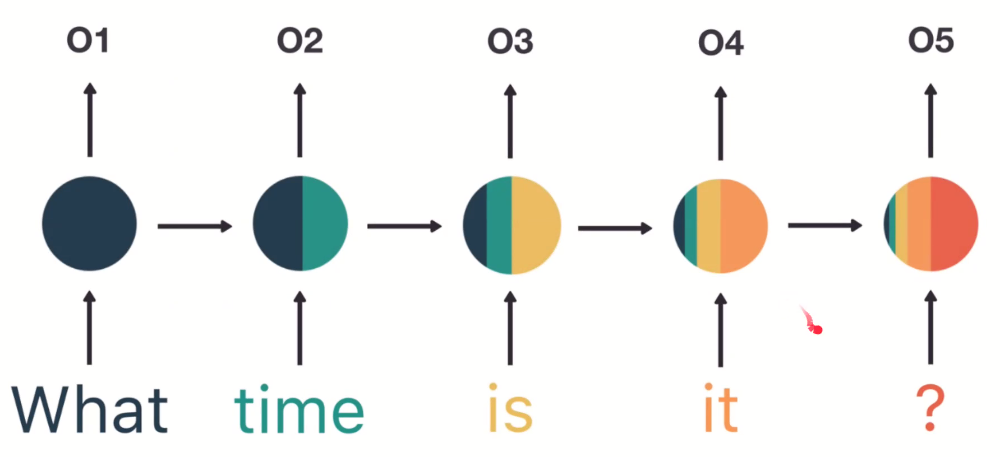

## Feed Forward
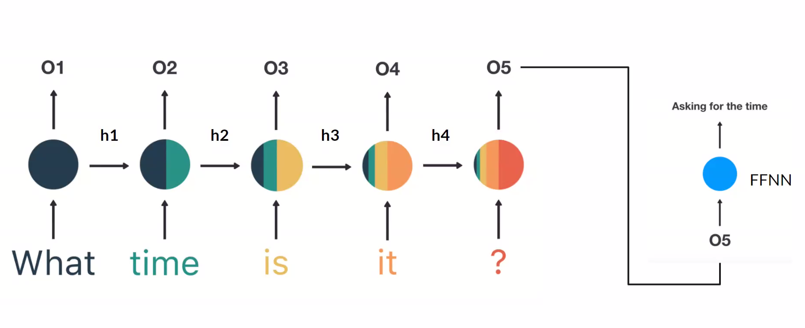

## Previous State Input Neuron
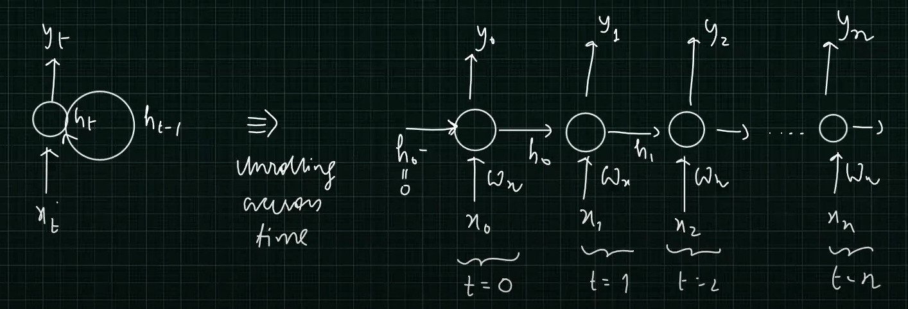

## Previous State Input ANN
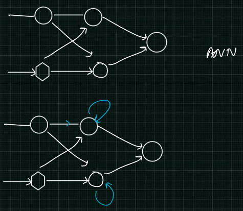

## Back Propogation Through Time
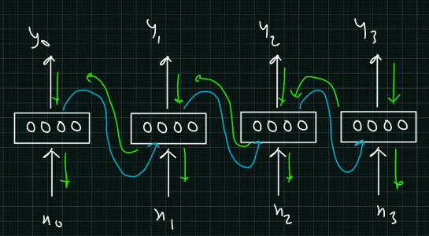

## Types of RNN Configuration
### Seq to Seq
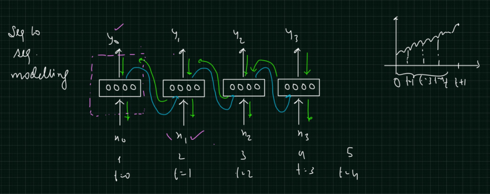

### Seq to Vector
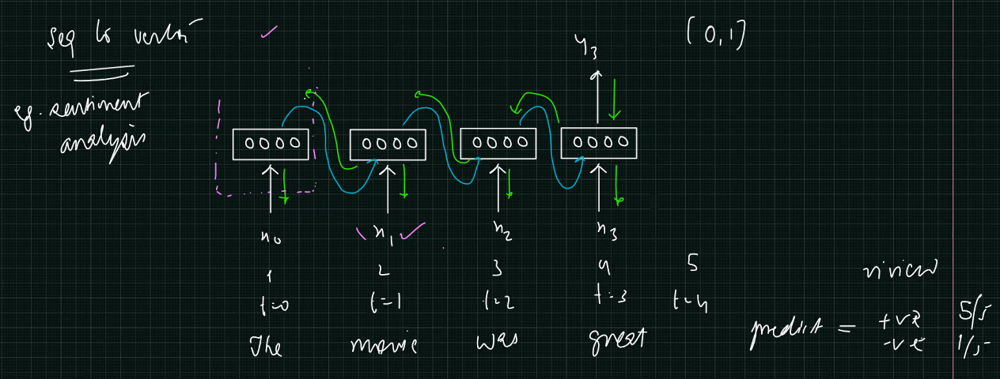

### Vector to Sequence
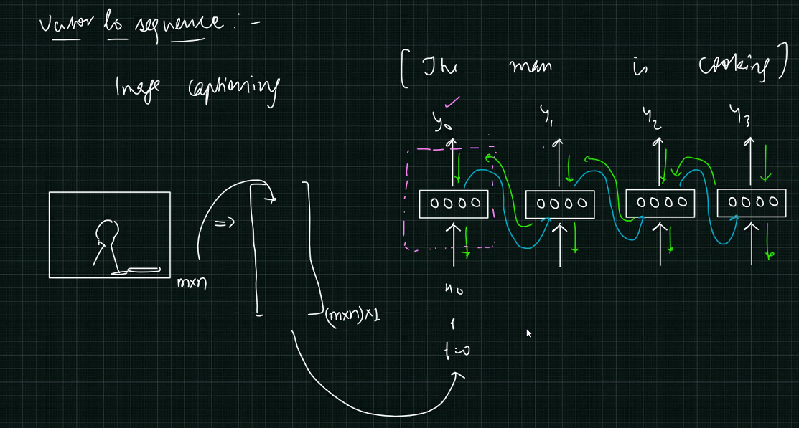

### Encoder-Decoder
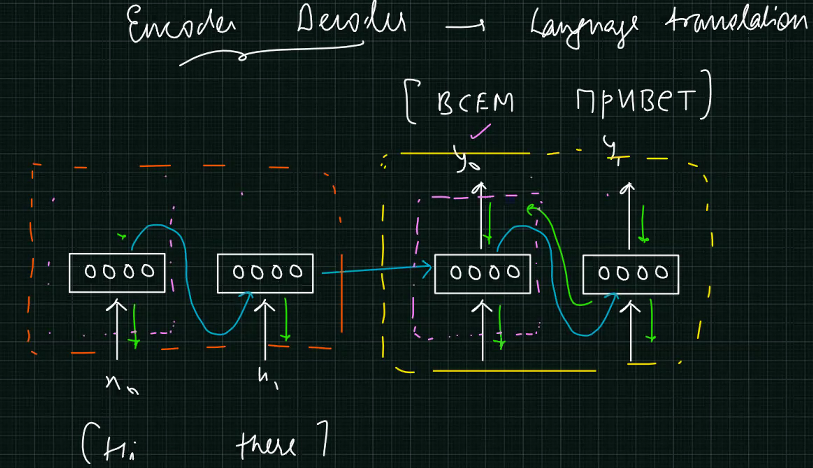

## RNN Equation and Weight Matrix
### Partial derivative
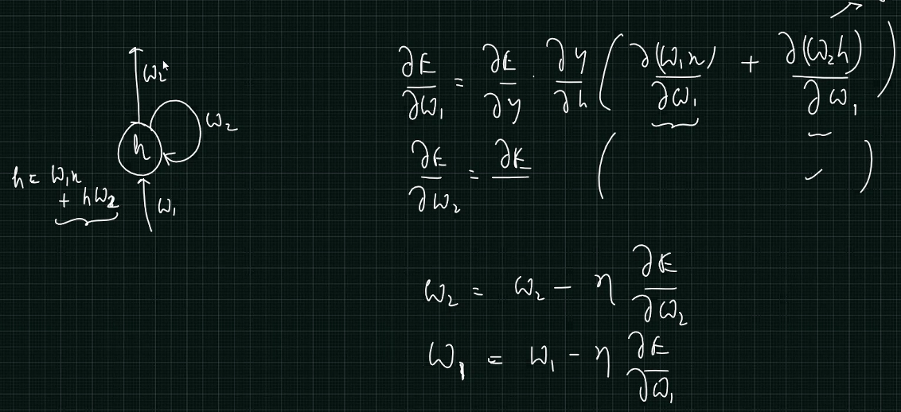

### Weight Matrix
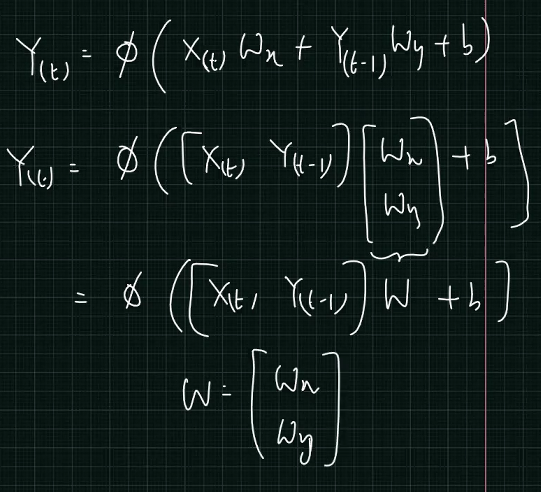

## How does RNN works
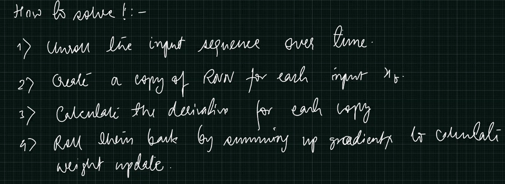
