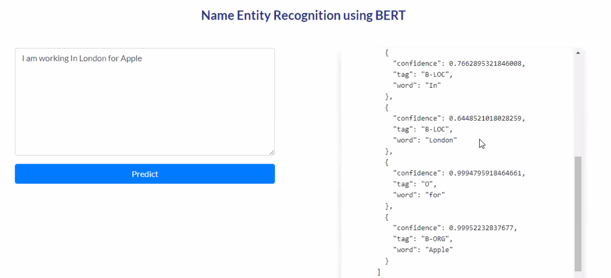

# Named Entity Recognition
- Text parsing
- Text processing
- Data annotation
- Model training
- Model evaluation
- Model retraining
  - Data augmentation
- Database integration
  - Redis or Elasticcache
- Build a webapp
- Package the solution
  - Write 10-20 test cases
  - Push it to `pypi` and also image for `dockerhub` 
- Host it on Kuberbetes cluster

## Resources needed
- GPU
- Annotation tool (spacy, prodigy)
- Augmentation library

## Example

